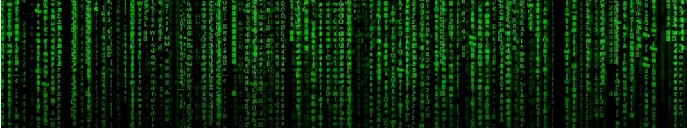

  

  <h2>From Python to TypeScript: A Side Journey Through Programming</h2>

I first started experimenting with programming in 2021 by playing around with Python. At the time, I wasn’t aiming to become a developer—I was just curious about what coding could do. I remember being fascinated by simple for loops and if statements, and I even put together a basic “choose your own adventure” text game. It wasn’t polished, but it showed me how a few lines of logic could create something interactive. For me, it was more of a fun project than a serious pursuit.

As my interests grew, I found myself drawn more toward information security, networking, and system administration rather than pure software development. This created an interesting challenge: my coursework and degree path required me to learn programming in depth, but my career goals were headed in a different direction. Studying Java, C, C++, JavaScript, and eventually TypeScript forced me to think like a developer even though I was imagining myself more in a networking or infosec role. At times, it felt like I was learning a skillset parallel to—but not directly aligned with—what I thought I needed.

Despite that challenge, the journey has been rewarding. With Java, I learned how to structure programs into objects and methods, which taught me discipline in organizing larger projects. With C and C++, I confronted low-level details like memory and pointers, which gave me insight into how software interacts with hardware. JavaScript then introduced me to web programming, though I quickly realized how difficult debugging could be in a loosely typed environment.

This is where TypeScript stood out. TypeScript gave me the same flexibility of JavaScript while adding type safety and structure. The compiler acted like an extra set of eyes, catching mistakes before my code even ran. I found that coding in TypeScript felt cleaner, more predictable, and ultimately more enjoyable. It was the first time I saw how programming discipline could translate directly into reliability, a concept that overlaps heavily with both networking and infosec.

Looking back, my coding abilities have grown tremendously since my first Python experiments. What once felt like trial-and-error with loops and conditions has turned into the ability to work confidently in multiple languages, design structured programs, and understand the trade-offs between efficiency, readability, and maintainability.

Although I still see myself pursuing a future in networking or information security, I view programming as an asset rather than a detour. Understanding software development makes me a stronger candidate in fields where automation, scripting, and system analysis are increasingly valuable. Whether it’s writing a script to scan logs, building tools for penetration testing, or automating network tasks, the programming background I’ve gained will only enhance what I can do.

Key Takeaways
	•	Python (2021): Sparked my interest with simple loops and conditions, leading to fun experiments like a text adventure game.
	•	Java, C, C++: Forced me to dive deeper into structured programming and system-level thinking.
	•	JavaScript → TypeScript: Showed me the importance of typing, structure, and scalability in modern applications.
	•	Career Connection: Even though my focus is on networking and infosec, programming skills will be a valuable tool in automating tasks and solving real-world problems.

Looking Ahead

While I don’t expect to become a full-time developer, I see programming as part of my toolkit. My plan is to continue refining these skills while moving forward in networking and information security. What started as a curiosity in Python has become a foundation I can carry with me throughout my career.

  

