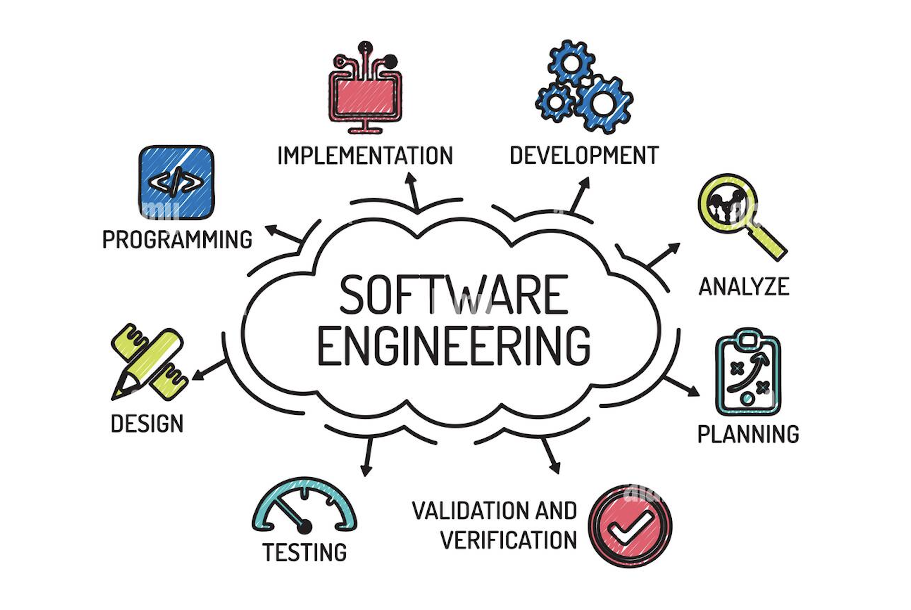

  

---

  <h2> Reflecting on Software Engineering </h2>

This class introduced us to more detail of the process that comes with software engineering. Up to this point, the extent of our coding experience has been writing a program in an IDE to meet a submission date. This was the first class I have taken involving multiple pieces of technology, group projects, and common mothedologies. This exposure helped me learn how much more effort goes into large applications, far beyond writing the correct code to meet an objective. Specifically, this course helped me understand the importance of Agile Project Management, Configuration Management, and Design Patterns.

  <h2> Agile Project Management and Issue-Driven Development </h2>

Project management is a common term I think most people can assume correctly. One particular type of project management we focused on in this course was Agile Project Management. This approach is useful in organizing and managing software projects by attempting to break large problems or work that needs to be done into small, incremental tasks that can be completed and implemented quickly. This format emphasizes flexibility, collaboration and continuous improvement.

Issue-Driven Project Management is what we used during our capstone group project. This consisted of clearly identifying a goal we had in mind, then breaking that into smaller, more digestable, goals and tracking them in a shared repository. These issues could represent a specific task, bug, feature or improvement. In doing this, everyone on the team had an overview of what still needs to be done and what others are currently working on. Our developers were able to select an issue to work on, create a branch off of our main repo, then submit and review changes through pull requests.

With this being the first group project I have been a part of, it easy to notice the benefits of this type of working environment. There was almost always very clear understanding in what the team as a whole needed to do and simple steps to take for continous improvement. This mitigated the possibility of any one member of the team being confused, overwhelmed, or unsure in how to move forward. While we only had a few weeks of exercise in this space, it's fairly obvious how beneficial this kind of workflow is in the practical world of software engineering and development.

  <h2> Configuration Management </h2>

Another massive benefit I learned from this class is configuration management. Put simply, this is the process of controlling changes to software over time. Tracking versions of the code, managing different branches, handling dependencies and ensuring the development, testing and production environments all remain consistent.

Before this class, I did not have much exposure to the importance of configuration management. I was familiar with basic version control and understood that different parts of a system needed to remain compatible, but this was my first time working with multiple parts that changed often. The project really opened up the experience of encountering unexpected configuration issues and working through how to fix them. While they were usually a simple fix, it showed me that it does take some time and energy as the project progressed, unlike the set and forget I had been used to.

I think this was one of the most valuable aspects of the final project, and the course as a whole. I had began to get frustrated with the previous coursework, as I was not confident in truly understanding how software was developed. I could write lines of code that printed something to the console, but connecting that to a fully functional website was all blank space in my mind. With this course filling in the gaps, I do feel more educated in software development overall.

  <h2> Design Patterns </h2>

Design patterns are reusable solutions to common problems in software design. Rather than focusing on specific syntax or frameworks, design patterns describe proven ways to structure code so it is easier to understand, extend, and maintain.

During this course, I saw design patterns emerge naturally in our project. For example, separating server logic from client components, using shared utility functions, and centralizing data access through service files are all examples of design patterns. These patterns reduce duplication and make the codebase easier to modify without breaking unrelated parts of the system.

Design patterns apply to all areas of software engineering. Whether building a mobile app, a game engine, or a cloud service, engineers rely on patterns to manage complexity. Learning to recognize and apply these patterns helped me think more like an engineer rather than just a programmer.

  <h2> Ethics in Software Engineering </h2>

Finally, this course reinforced the ethical responsibilities of software engineers. Ethics in software engineering involves considering how software affects users, organizations, and society. This includes protecting user data, avoiding deceptive design, ensuring accessibility, and being honest about system limitations.

Working on a real project made these concerns feel concrete. Decisions about authentication, permissions, and data visibility are not just technical choices—they impact privacy and trust. Even small mistakes can lead to security vulnerabilities or user harm. This awareness will influence how I approach future projects, especially those involving sensitive information.

---

  <h4> Conclusion </h4>

Overall, this course taught me that software engineering is about much more than building web applications. Concepts like Agile Project Management, Configuration Management, and Design Patterns apply across all types of software systems. Through hands-on experience, I learned how engineering decisions affect not only functionality, but also reliability, collaboration, and ethics. These lessons will carry forward into any technical project I work on in the future, regardless of platform or programming language.
