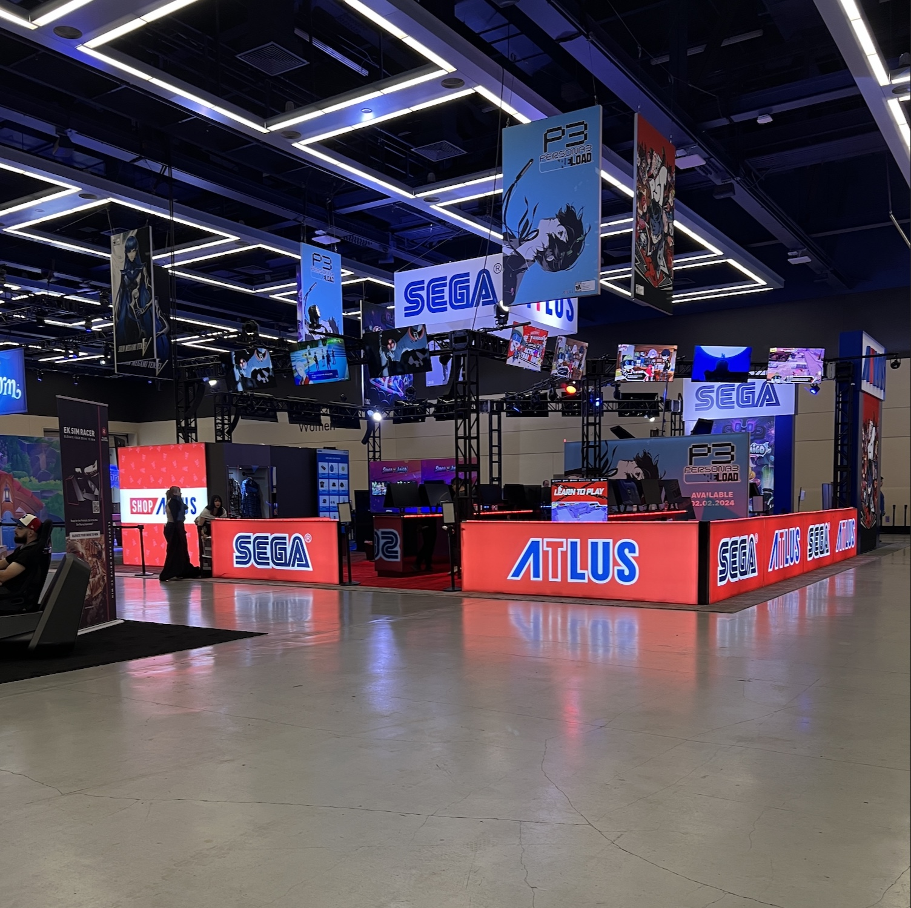
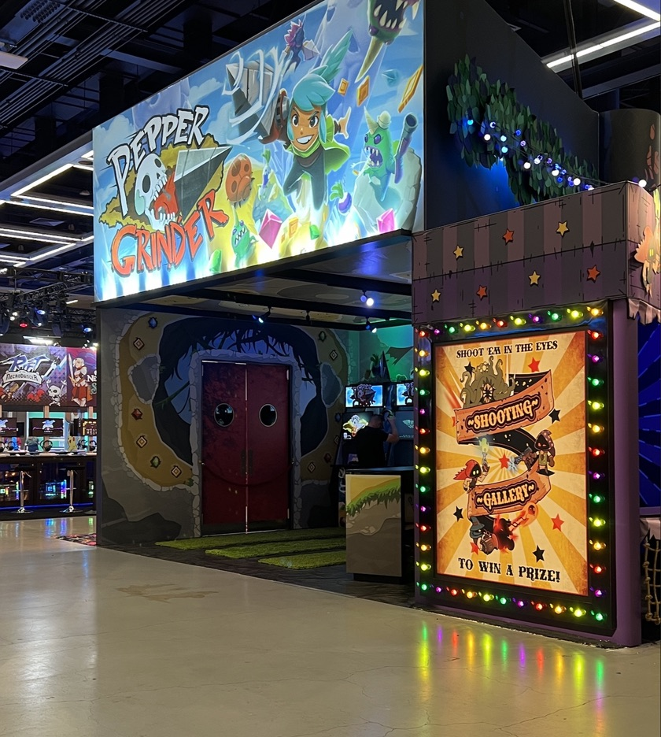
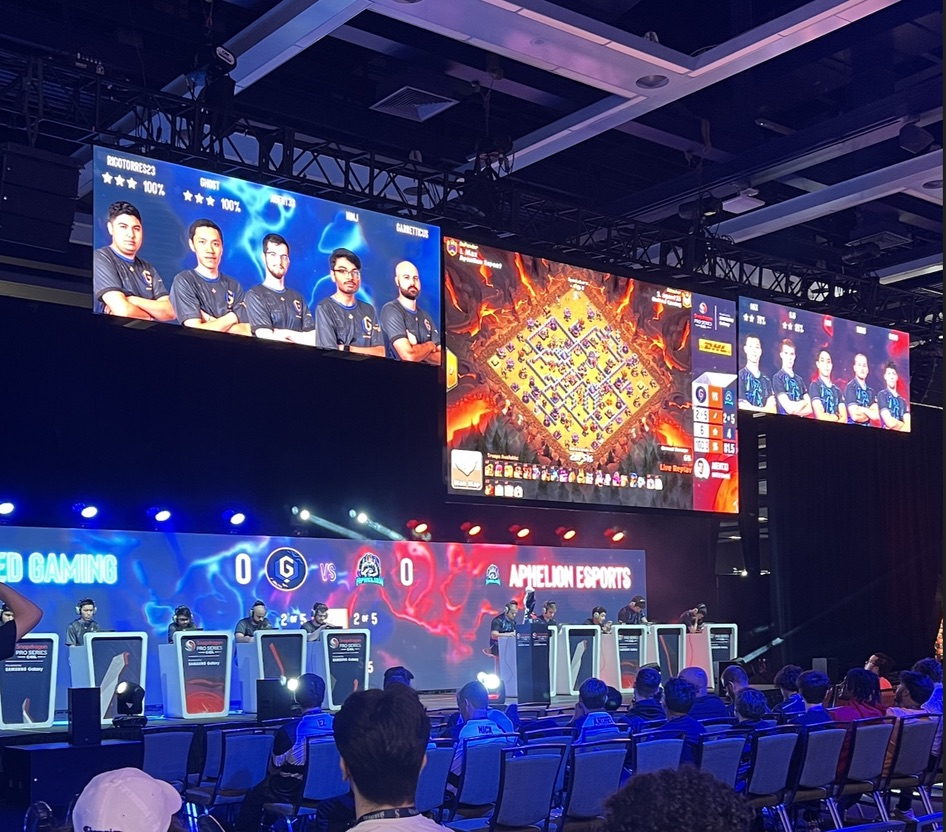

  
  
  

<h3 class="text-center">Event-Based Networks – Large-Scale Conventions and Live Events</h3>

Managing event-based networks presents a unique set of challenges. Strict time constraints, evolving client requirements, and last-minute network requests are often encountered under the pressure of a **high-profile convention**. Unlike permanent enterprise networks, designing and deploying a full wired and/or wireless network to be used for only a few days requires a level of flexibility I never anticipated. With over two years of experience in this industry, I can confidently say that the reward of delivering a safe, reliable network for both event staff and attendees far outweighs the stress and effort it takes during planning and deployment.

The most common challenges would have to be last-minute changes or adjustments to event layouts, exhibitor requests and network functionality. Staying ahead of the project is crucial, as the time constraint is always a factor, and getting as much information as soon as possible helps a immensely with planning and deployment. Another, very critical element, of a successful event comes down to the **team and communication.** Thankfully, I have always had a fantastic team beside me that allows me to perform in the most efficient and effective way possible. With multiple moving parts spread across several  departments, miscommunication or information delays can be detrimental to success.

#### Key's to Success
- **Plan Early:** Reach out to the event’s technical department and show management as soon as possible. While initial details will almost certainly change, having a baseline plan in place makes it far easier to adapt to last-minute adjustments.
- **Communication and Teamwork:** Clear, accurate communication within your team is always a top priority. With so many moving parts, efficiently relaying information helps prevent delays and misunderstandings, ensuring the entire team stays aligned. 
- **Expectations and User Density:** Always prepare for higher-than-expected attendance. While clients often provide estimates based on historical data, planning for a larger headcount builds in flexibility and ensures the network can handle unexpected surges.
- **Documentation:** Just because a setup works during installation doesn’t mean it will work later. Maintaining accurate documentation of IP addresses, switch ports, and device locations makes troubleshooting and last-minute changes significantly more manageable.

#### Practical Outcomes
Following these guidelines will (hopefully) prevent silly mistakes, provide some breathing room for you and your team, and give you an upper hand on providing **resilient, scalable networks** on the fly.
- Reduce last-minute stress by planning early and properly documenting the full deployment.
- Provide a high-density and reliable network that should reduce the amount of troubleshooting needed.
- Ensure you and your team are always on the same page, relaying any new or adjusted information.
- Deliver consistent, reliable **enterprise-class connectivity under tight deadlines** and high pressure.  
