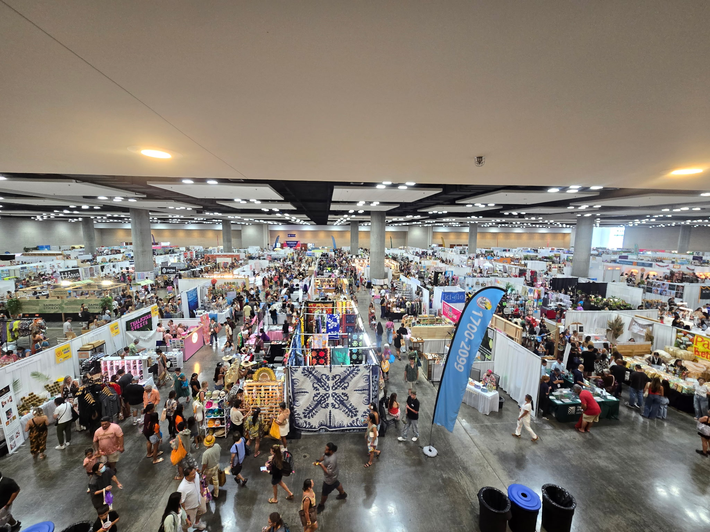

  
  
  

### Event-Based Networks – Large-Scale Conventions and Live Events

Managing event-based networks presents a unique set of challenges. Strict time constraints, evolving client requirements, and last-minute network requests are often encountered under the pressure of a high-profile convention. Unlike permanent enterprise networks, designing and deploying a full wired and/or wireless infrastructure to be used for only a few days requires a level of flexibility I never anticipated. With over two years of experience in this industry, I can confidently say that the reward of delivering a safe, reliable network for both event staff and attendees far outweighs the stress and effort it takes to get the job done.

The most common challenges would have to be **last-minute changes** to event layouts, exhibitor requests and network functionality. Staying ahead of the project is crucial, as the time constraint is always a factor, and getting as much information as soon as possible helps a immensely with planning and deployment. Another, very critical element, of a successful event comes down to the team and communication. Thankfully, I have always had a fantastic team beside me that allows me to perform in the most efficient and effective way possible. With multiple moving parts spread across several  departments, miscommunication or information delays can be detrimental to success.

#### Key Contributions
- **Rapid Adaptation to Layout Changes:** Respond to last-minute adjustments in floor plans and booth placements by rerouting cabling, deploying dummy switches and extending wired/wireless connectivity.  
- **Wired & Wireless Interconnectivity:** Integrated wired drops for production and exhibitor reliability with high-performance wireless coverage for staff, attendees, and guests — ensuring seamless connectivity across both infrastructures.  
- **High-Density Wireless Support:** Deployed and tuned supplemental APs in keynote halls, gaming arenas, and expo floors to support thousands of simultaneous client devices without degradation in speed or reliability.  
- **Client & Vendor Coordination:** Worked closely with event organizers, corporate clients, and production teams to define requirements, communicate capabilities, and implement contingency plans for bandwidth surges and environmental interference.  

#### Outcome & Impact
The deployments resulted in **resilient, scalable networks** capable of delivering professional-grade connectivity in dynamic and unpredictable environments:

- Exhibitors and production teams received reliable wired services, even during unplanned expansions.  
- Attendees experienced stable wireless performance in high-density venues.  
- Standardized deployment processes reduced troubleshooting overhead and accelerated setup times.  
- Clients gained confidence in the ability to deliver **enterprise-class connectivity under tight deadlines**.  
