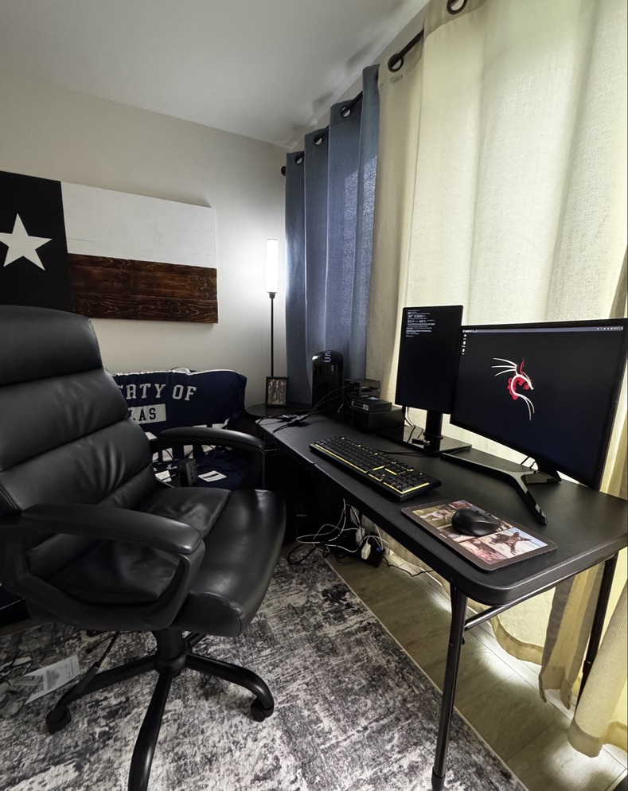

<h3 class="text-center">Home Lab – Security Testing and Network Experimentation</h3>

I have wanted an isolated home lab for a couple of years, separate from my regular use network. Over summer, I was cleaning out my closet and came across an old Raspberry Pi 4B from 2021. After I powered it up and connected, I was online ordering another 4B as well as the Raspberry Pi 5. My goal was fairly simple, created a safe and practical learning environment for **pentesting, network hardening and security best practices**.

Once all of the equipment came in, I began with flashing the two 4B's with **Ubuntu Desktop** and **Ubuntu Server**. I had figured these would be more of target machines, so the lower RAM was suitable. I then configured **Kali Linux** and **OpenWRT** (for routing and network segmentation) on the two model 5's. It took a little while to ensure everything was connected through a small 5 port managed switch and static IP addressing, completely separate from my home network. First, on Kali, I used **NMAP** to scan the network and find the target machine. I already knew the targets address, but I wanted this to be a real world simulation, so there was plenty that I pretended not to know. I then built out a custom, short, password library that included the known password to run through NMAP again to see if it would return what the password was. Unfortunately, it returned a message saying that there is a password on this list that is used, but wouldn't tell me which one.

After that, I deployed **OWASP Juice Shop** on my Ubuntu Desktop, a deliberately vulnerable web application used commonly in beginner information security and pentesting practice. From Kali, I successfully executed a SQL Injection attack by inserting a crafted character into the login field. Though it wasnt much, it did give me a feeling of progress as I had been sweating over how to just get start and what I should do for weeks. This gave me some hands on experience with exploiting web application vulnerabilities in a safe and secure environment.

My next plan is to continue the same path and maybe work with Hydra next time. With work and school taking up the majority of my time, I think my home lab might collect some dust for the next few months but I will be back on it come holiday break. Even though I didn't make much progress, it was nice to brush up on some things I'm familiar with *(static addressing, CIDR notation)* and make some attempts with new technologies. I also have not put my OpenWRT or Ubuntu Server to much use, so I will look to implement them on my next iteration. Overall, I learned some things and that was the main goal I had in mind when I started.

#### Experience Gained
- **Static Addressing:** Configured static IP addresses on Raspberry Pi devices, ensuring a direct connection and segregation from my home network.
- **NMAP:** Used NMAP for reconnaissance to discover potentially vulnerable target machines, open ports and activley running services.
- **Password Testing:** Built and deployed a custom password library used to simulate how hackers are able to obtain passwords in real world application.
- **System Monitoring:** Through each evolution, monitored and evaluated the target machine to identify and abnormalities from the end-user perspective.

