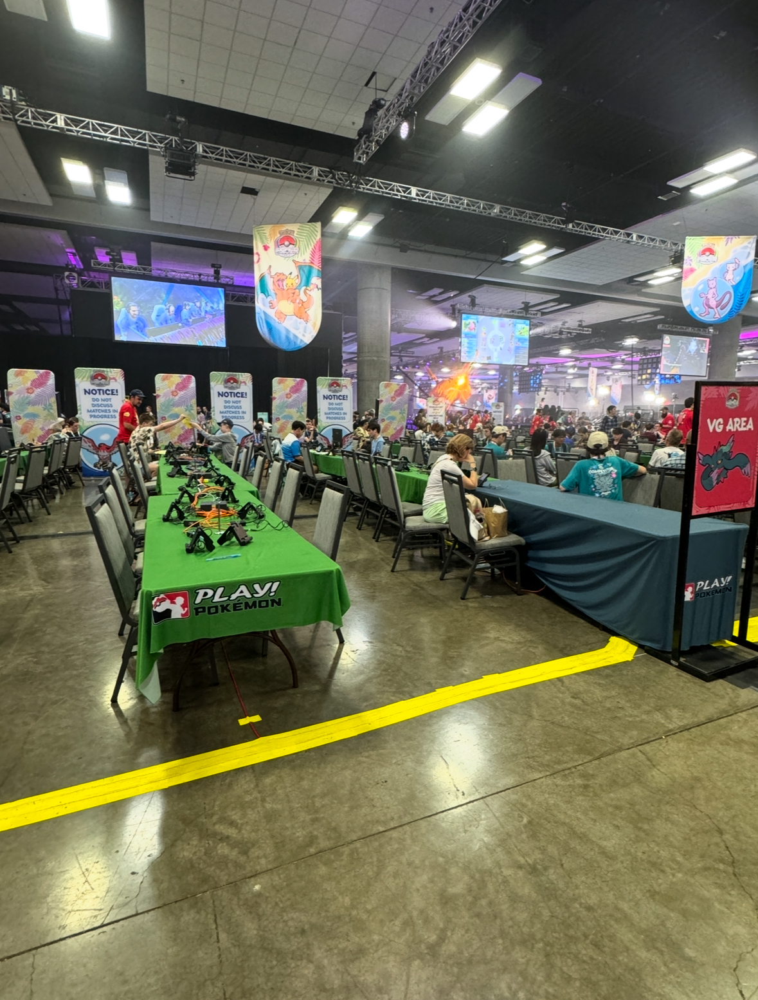
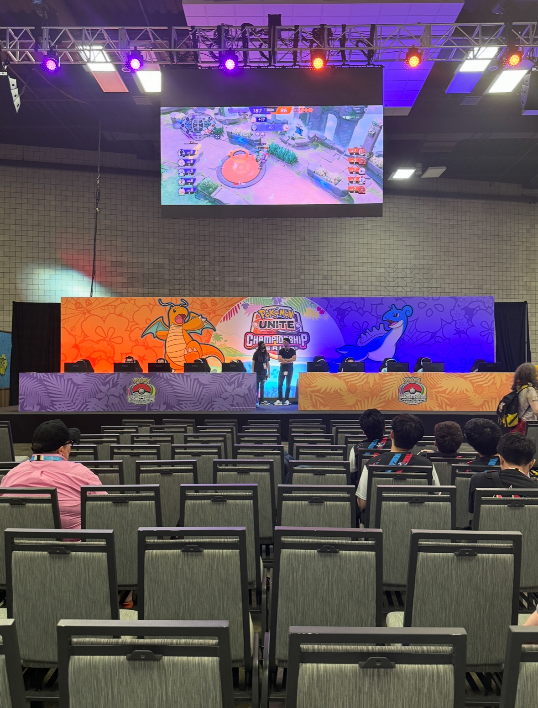
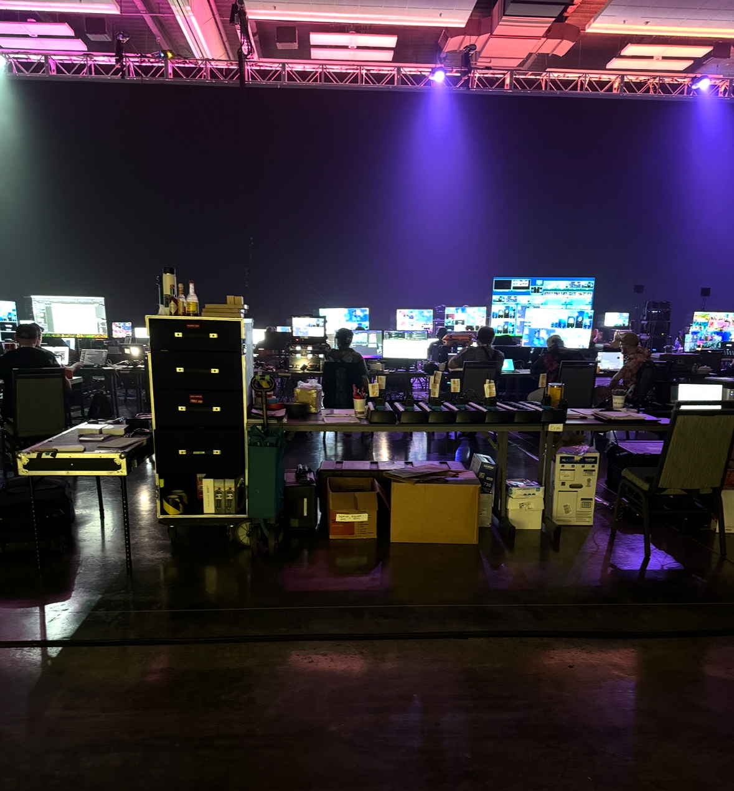

### Network Infrastructure Upgrade – Hawaii Convention Center

I led a comprehensive upgrade of the Hawaii Convention Center’s network infrastructure to improve reliability, bandwidth, and long-term scalability.  
The upgrade was driven by recurring issues during large events, most notably the **Pokémon World Championships**, where the existing 1G fiber backbone could not handle the demand for high-speed, high-density connectivity. In addition, our older IDF switches lacked **Power over Ethernet (PoE)**, forcing us to run supplemental wireless access points with separate inline power injectors. This added complexity, increased failure points, and slowed down deployments during time-sensitive events.  

To address these challenges, I managed a full refresh of the distribution layer, modernizing the convention center’s network environment.  

#### Key Contributions
- **Switch Replacement (IDF Modernization):** Deployed new enterprise-grade IDF switches across the facility, retiring legacy hardware, enabling PoE, and standardizing configurations for easier long-term management.  
- **Cabling & Cross-Connectivity:** Re-punched copper connections onto the 110 block to establish clean, fully cross-connected terminations, reducing patching errors and improving serviceability.  
- **Fiber Backbone Upgrade:** Migrated uplinks from 1G to 10G fiber, significantly boosting backbone throughput to support large-scale events like Pokémon and other high-bandwidth conferences.  
- **Wireless Infrastructure Support:** Eliminated the need for inline power injectors by leveraging PoE-enabled switches, making supplemental AP deployments faster, cleaner, and more reliable.  
- **Decommissioning & Cleanup:** Wiped and securely retired old switches, ensuring a clean transition and removing outdated equipment from the network environment.  

#### Outcome & Impact
The upgrade transformed the Hawaii Convention Center’s infrastructure into a **high-capacity, resilient network** capable of supporting modern conventions and international-scale events.  
- High-demand events now run without bandwidth bottlenecks.  
- Wireless deployments are faster and more reliable due to PoE support.  
- Network resiliency and serviceability were improved through standardized configurations and clean cross-connects.  
- The foundation is in place for **future growth and scalability**, allowing the center to keep pace with evolving event requirements.  
