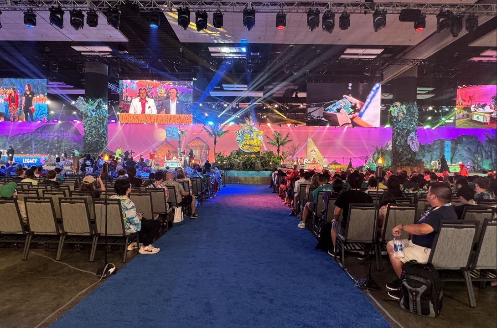
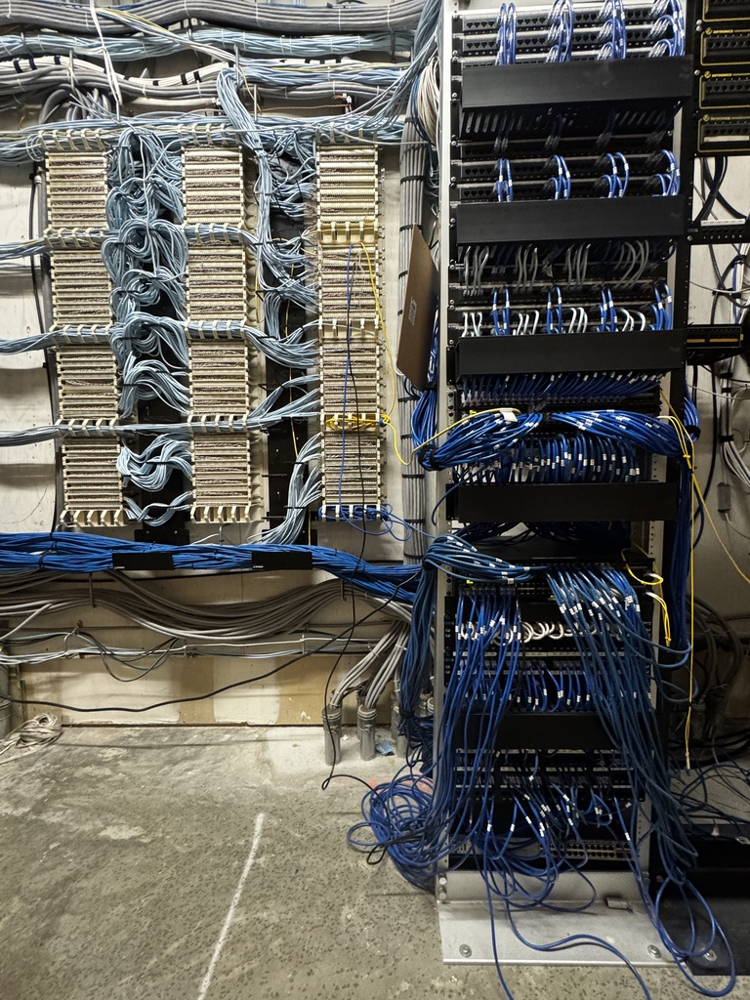

  

<h3 class="text-center">Network Infrastructure Upgrade – Hawai'i Convention Center</h3>

I led a complete, facility-wide, upgrade of the Hawai'i Convention Center’s network infrastructure to improve reliability, bandwidth, and long-term scalability.  

The upgrade was driven by recurring issues during large events, most notably the **Pokémon World Championships**, where the existing 1G fiber uplink fell short of the events requirements. Due to the global visibility and high-profile nature of the event, the company approved a full network upgrade to meet the clients demanding performance requirements. Aside from the bandwitch boost to the building, we also obtained **Power over Ethernet (PoE)** throughout our IDFs, which improved deployment speed and accuracy of supplemental access points for future events. Running inline power for each supplemental in high-density areas created an additional point of failure and added valuable time to the process, which can be critical in an event based networking environment.

To overcome these challenges, I coordinated the deployment, installation and documentation of the distribution layer for the entire facility.

#### Key Contributions
- **Switch Replacement:** Coordinated with our NOC to deploy 30+ newer enterprise-grade 3850 series switches with PoE+ capability across all 16 IDFs, retiring legacy hardware, and standardizing configurations for easier long-term management.  
- **Cabling & Cross-Connectivity:** Re-terminated copper connections onto the 110 block and patch panels to establish clean, fully cross-connected and usable floor/wall ports, reducing patching errors and improving network deployment time.  
- **Fiber Backbone Upgrade:** Migrated uplinks from 1G to 10G fiber, significantly boosting backbone throughput to support large-scale events like Pokémon and other high-bandwidth conferences.  
- **Wireless Infrastructure Support:** Eliminated the need for inline power injectors by leveraging PoE-enabled switches, making supplemental AP deployments faster, cleaner, and more reliable.  
- **Decommissioning & Cleanup:** Wiped and securely retired old switches, ensuring a clean transition and removing outdated equipment from the network environment.  

#### Outcome & Impact
The upgrade transformed the Hawai'i Convention Center’s infrastructure into a **reliable and efficient network** capable of supporting modern conventions and international-scale events.  
- High-demand events now run without bandwidth bottlenecks.  
- Wireless deployments are faster and more reliable due to PoE support, reducing labor hours and directly improving **Smart City Networks** bottom line.  
- Network resiliency and serviceability were improved through standardized configurations and clean cross-connects.  
- The foundation is in place for **future growth and scalability**, which will come in handy for our next upgrade phase happening in 2026.  
