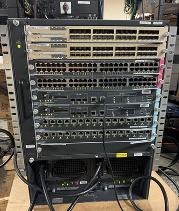
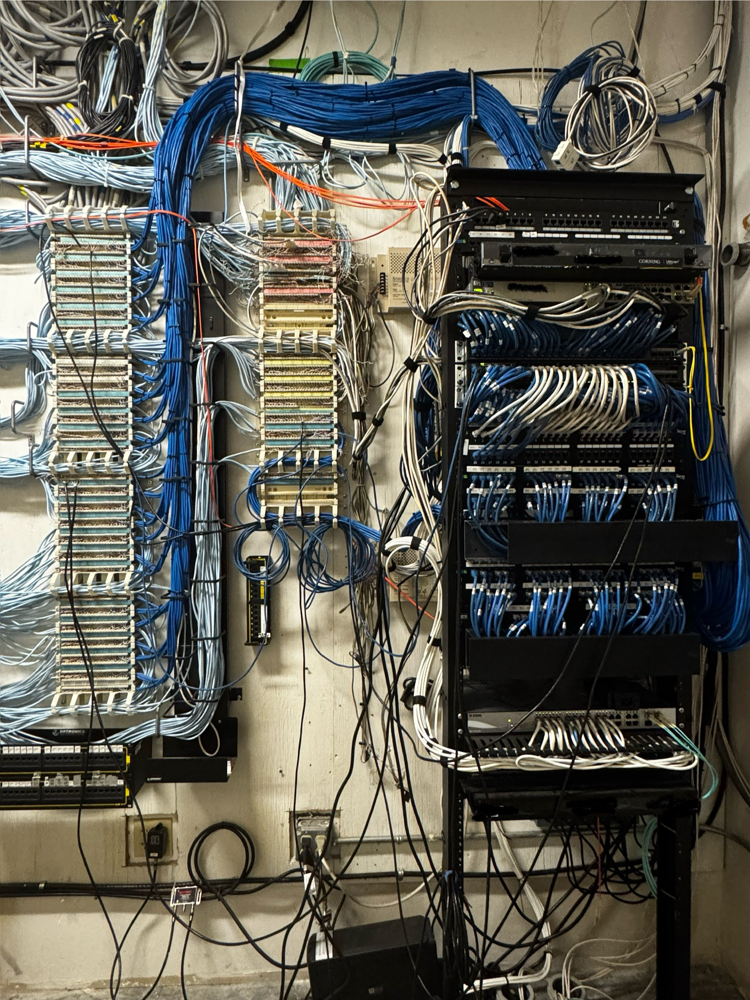
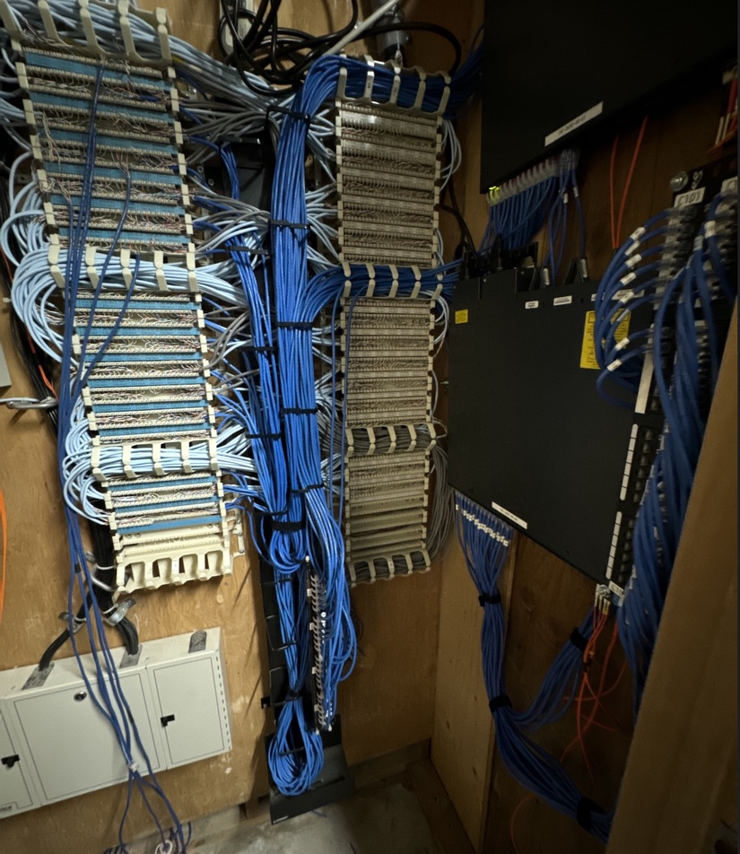

<h3>Network Infrastructure Upgrade – Hawaii Convention Center</h3>

### Network Infrastructure Upgrade – Hawaii Convention Center

I led a comprehensive upgrade of the Hawaii Convention Center’s network infrastructure to improve reliability, bandwidth, and long-term scalability.  
This project involved replacing outdated hardware, reworking cabling for efficiency, and implementing higher-capacity fiber uplinks.  

#### Key Contributions
- **Switch Replacement (IDF Modernization):** Deployed new enterprise-grade IDF switches across the facility, retiring legacy hardware and standardizing configurations for easier long-term management.  
- **Cabling & Cross-Connectivity:** Re-punched copper connections onto the 110 block to establish clean, fully cross-connected terminations, reducing patching errors and improving serviceability.  
- **Fiber Backbone Upgrade:** Converted uplinks from 1G to 10G fiber, dramatically increasing backbone throughput to support high-demand event traffic.  
- **Decommissioning & Cleanup:** Wiped and securely retired old switches, ensuring a clean transition and removing outdated equipment from the network environment.  

#### Outcome & Impact
This upgrade provided the Hawaii Convention Center with a more reliable, higher-capacity network capable of supporting modern conventions and large-scale events.  
The improvements reduced potential bottlenecks, increased resiliency, and set a stronger foundation for future technology growth.
